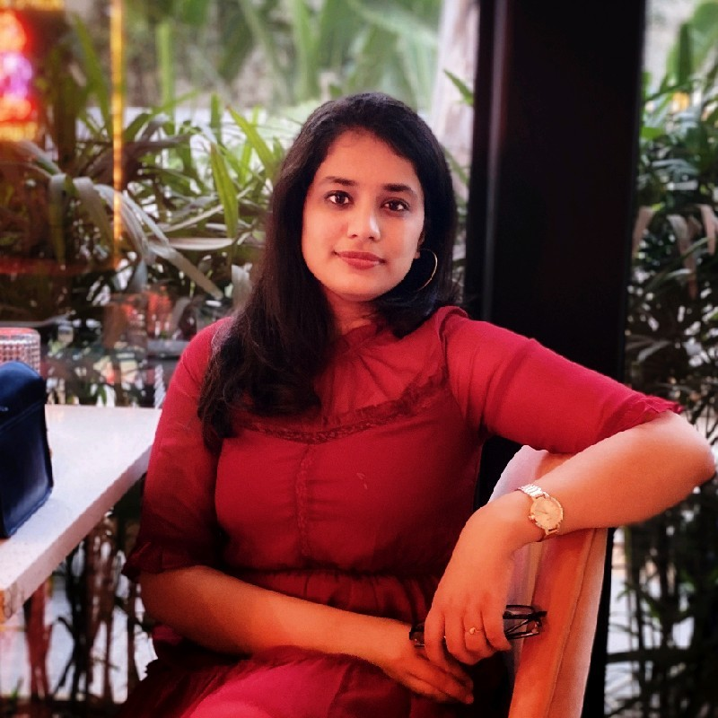

# Venkata Krishna Sri Chandana Manuri

## Biography
Hello, wonderful people! I'm Chandana! 🎉 While my name comes with many variations, I’m happiest just being called Chandana!

Currently, I’m immersing myself in a Master's in Business Analytics and Information Systems at USF. Before this adventure, I spent 2.5 years as a Custom Software Engineer (.NET) at Accenture. My tech journey began unexpectedly with a mechanical engineering degree, but building a website for my book club during the COVID lockdown ignited my passion for software development.

At Accenture, I realized how fast-paced the tech world is—keeping up with the latest trends and tools is essential! That's why I chose to dive deeper into data, aiming to sharpen my skills and broaden my horizons.

When I’m not crunching numbers or coding, you can find me dancing my heart out or getting lost in fiction books. I love the escape they offer—each page is a chance to live a different life!

I’d love to connect with fellow tech enthusiasts or book lovers, so feel free to reach out! Thanks for stopping by my markdown page! Toodles! 🌟

